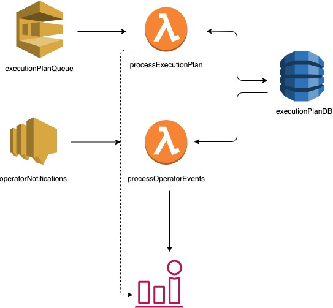

# Contains source code of AWS CDK and Lambda functions

## Useful commands

 * `aws config` to set the credentials for AWS account where the stack needs to be rolled out
 * `./cdk-deploy.sh` to run the creation of CDK stack and also build and compile the lambda code
 * `npm run test` to run test cases.
 * `npm run coverage` to run test cases and show coverage.

 ## Architecture overview
 
